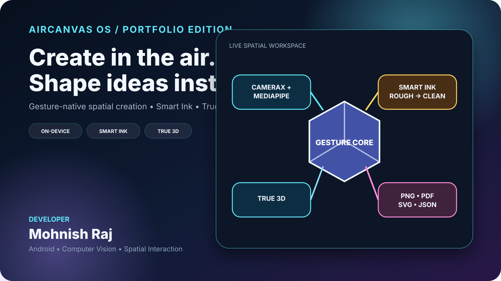

# AirCanvas OS — Portfolio Edition

## v2.2 engineering focus

The portfolio build now demonstrates product hardening, not only feature count:

- gesture-state design that distinguishes a real pinch from a visible gap or fist
- bounded on-device personalization without uploading camera or calibration data
- deterministic gesture-palette selection under transient landmark dropouts
- reflection-tested multi-stroke handwriting recognition
- landscape-first responsive interaction across 2D, Smart Ink and true 3D tools

## What this project proves

AirCanvas OS is a native Android spatial-creation prototype built around a live camera workspace. It demonstrates mobile computer vision, gesture-state design, editable vector scenes, offline-first storage, export pipelines, true 3D projection, performance control, and production-oriented QA.

## Client-facing highlights

- CameraX + MediaPipe hand tracking with frame coalescing and adaptive cadence
- Reliable pinch, fist, open-palm dwell, directional swipe, V-sign palette, and two-hand transforms
- Smart Ink conversion from rough strokes to editable shapes or on-device handwriting text
- True 3D cube, sphere, cylinder, pyramid, and cone rotation on X/Y/Z
- Professional Style Studio with cohesive visual presets, stroke control, opacity, locking, alignment, and distribution
- Portfolio Showcase scene and full-screen presentation mode
- One-tap 16:9 portfolio poster export with project metrics and developer credit
- Local autosave, project library, JSON import/export, SVG, PDF, and transparent PNG
- Privacy-sensitive permission audit and GitHub Actions APK verification

## Engineering decisions worth discussing in an interview

1. Gesture events are separated from UI actions through a deterministic state engine.
2. Pinch release uses a raw-distance fast path so smoothing cannot produce a long accidental tail.
3. Camera frames are normalized into the preview orientation before inference.
4. Only the latest frame is kept and only one inference runs at a time.
5. True 3D meshes are projected and depth-sorted, then cached until geometry changes.
6. Undo history is bounded by both entry count and estimated memory.
7. Export dimensions and imported scene sizes are guarded against unsafe allocations.
8. Portable JVM harnesses verify core behavior before the Android build begins.

## Suggested portfolio caption

> I built AirCanvas OS, a native Android spatial-creation prototype controlled by hand gestures. It combines CameraX, MediaPipe, Smart Ink cleanup, real X/Y/Z 3D transforms, vector export, offline project storage, and adaptive performance telemetry. I designed the gesture state machine, rendering model, export pipeline, QA harnesses, and client-facing showcase experience.

## Honest status

This is an advanced portfolio prototype, not yet a finished Play Store product. Camera behavior still needs physical-device testing across multiple manufacturers, and the public product name is intentionally not locked.
